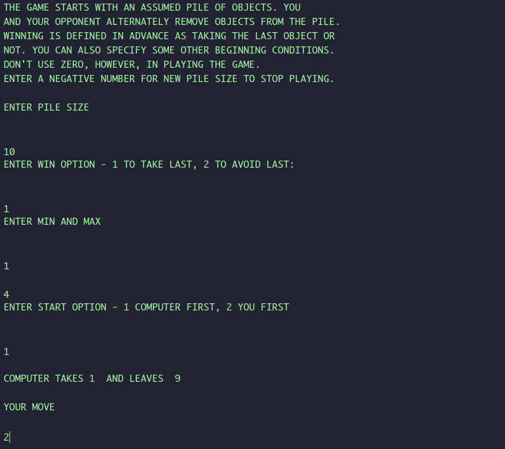

# `basic2js`

This is a most likely not bug free (non-trivial bugs either).

## Demo

Vintage BASIC game **batnum**, (found [here](https://www.atariarchives.org/basicgames/showpage.php?page=14)), is compiled to JavaScript, play it here:

http://batnum.surge.sh/



## High Level Goals

First of all, I wanted to run BASIC programs on the web. A very straight path towards this goal is obviously write a basic interpreter in js (or WebAssembly), many great solutions exist already; for example [Applesoft BASIC](https://www.calormen.com/jsbasic/), which is very well written and tested.

For a compiled solution, previously, I have created `basic2wasm` that compiles BASIC programs to WebAssembly (see repo root). However, a fatal flaw emerges once I added `INPUT` statement support to `basic_rs`. 

`basic2wasm` translates source code to `wasm` functions, yet runtime `INPUT` calls needs to pause `wasm` function call frame and resume execution once user has typed in a number. This is very problematic in browser's non-blocking environment. A hack was introduced to handle `INPUT` using `window.prompt`, which is one of a handful blocking js IO apis.

However, another problem arises, consider this example:

```basic
10 PRINT "Hello"
20 INPUT X
```

I have chosen to use actual DOM for printing, and while call to wasm main function does pause when executing line 20 (in compiled form) as `window.prompt`, the DOM updates produced in line 10 is not flushed on screen. Browsers will defer DOM updates produced in the same call frame of `window.prompt`, which means nothing gets flushed to the screen until the entire program (wasm main function) exits. 

`console.log` calls are in fact flushed, so a version of `PRINT` using that works as expected - a sub-optimal solution.

To actually run BASIC programs on the web **using DOM** as IO environment, we must compile BASIC source to **async** JavaScript functions.

## The Gist

A quick example, here is a very simple program using `INPUT`:

```basic
10 INPUT "Enter X and Y"; X, Y
20 PRINT "X + Y =", X + Y
30 END
```

The current `basic2js` compiles it to:

```javascript
var main = function*() {
  var __label__;
  var $x0;
  var $x1;
  $x0 = 0;
  $x1 = 0;
  env.printLabel("Enter X and Y");
  env.printAdvance3();
  env.printNewline();
  $x1 = yield env.input();
  $x0 = yield env.input();
  env.printLabel("X + Y =");
  env.printAdvance15();
  env.print($x1 + $x0);
  env.printNewline();
  return;
};
env.run(main());
```

The central idea is to represent BASIC program (and subroutines) as JavaScript **generators** (notice the `*` next to `main`). The js sources reads very much like a blocking IO program, however, it runs as a co-routine. Additional runtime machinery is packed in `env` object / namespace, `env.run` is as such:

```javascript
const INPUT = Symbol("Input");

env.input = function() {
  return INPUT;    
};

env.run = function (gen, x = undefined) {
  const { done, value } = gen.next(x);

  if (done) {
    return Promise.resolve(value);
  }

  switch (value) {
    case INPUT: {
      return printer.inputLine().then(number => run(gen, number));
    }
    default: {
      return run(gen, undefined);
    }
  }
};
```

`printer.inputLine` returns a `Promise` that resolves to a number when user presses `Enter` key on rendered `input` DOM element.

In addition, calling subroutines is also very natural:

```javascript
var fn$subroutine300 = function* () {
    // ...
}
var main = function* () {
    yield* fn$subroutine300(); // source: GOSUB 300
}
```

## Relooper

TODO: write up
